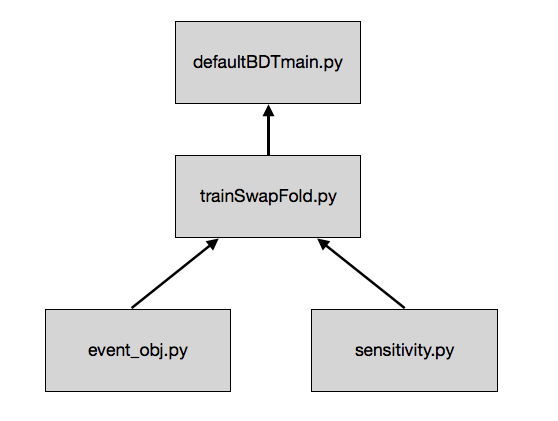

Python Analysis
====================

Processing data for use in Python 
--------------------

Root tends to work by storing files in NTuples on the hard drive as *.root* files, and relies on a fast I/O process to iterate through data when used with C++ (or alternatively with the Python bindings). However, the analysis in Python tends to need data structures that are held in working memory. The method I used to make the large NTuples feasible to use in Python's working memory was to preprocess the NTuple data through the VHbb cuts using the **root\_numpy** package, and then to save this processed data as a CSV file that can be loaded in by Pandas.

Note that at the time of my analysis, the volume of MC data after applying cuts and loaded into a Pandas `DataFrame` was sufficiently small to fit into working memory on my (pretty weak) laptop. If this isn't the case for you, you may need to look into chunking the data somehow.  

The */skl\_analysis/NTupleProcess.py* script takes the NTuples given to me by Andy and processes them into CSV files. To clarify, the NTuples I used for the analysis were:  

- Two signal MC NTuples, *Direct\_Signal.root* and *Truth\_Signal.root*.  
- A background MC NTuple, *background\_Normal.root*.  

These NTuples are loaded into Numpy arrays using the `root2array` function from the **root\_numpy** library. Note that you need to provide the name of the tree and an array with all of the branch names of the NTuple in the correct order, which you can find by using the TBrowser. This is very likely to be necessary, as the column formatting of provided NTuples change a lot from version to version.  

The multidimensional arrays are then converted into `DataFrame` objects with the same column headers, and then concatenated into one bulk DataFrame.  

The VHbb cuts based upon number of b-tags and number of jets is then executed using boolean indexing on the DataFrames. One DataFrame is created for two-tag events, and one for three-tag events. These are once again divided into two: an even DataFrame for events with even event numbers, and an odd DataFrame for odd event numbers. This is to replicate the train-test splitting that Andy implemented in his TMVA training code. All columns that will not be used in the analysis scripts are then dropped.  

Finally, the four DataFrames are written to four CSV files.  

Training and testing a BDT with Scikit-learn
--------------

The /skl\_analysis/defaultBDTmain.py script looks to replicate the entire BDT training and analysis process present on the HEP VHbb drive in a handful of Python scripts, the dependencies of which are outlined in the diagram below. The primary Python library used for this analysis is **Scikit-learn**.  

  

In summary, the analysis is processed as follows (separately for both the 2-jet and 3-jet data):  

- Data is populated into a list of Event objects.  
- Training DataFrames for each k-fold are readied into a format for use with Scikit-learn, and then input into ScikitLearn BDT objects for training.  
- Both trained BDTs process classification probabilities (decision scores) for data from the opposite fold, and the list of Event objects are update with these scores.  
- Decision scores for each event are normalised, transformed according to the VHbb TrafoD transform, before the corresponding sensitivity for the BDT is calculated.  
- The events are plotted into a decision score histogram, labelled by signal or background process type.  

Firstly, data is loaded into Pandas `DataFrame` objects from the processed CSV file corresponding to each k-fold (odd and even events), and each entry is assigned to an `Event` object via the populate\_events method, contained in a list. An `Event` object is a data structure made to encapsulate all relevant information for a candidate event.  

Before training, events in each k-fold of the training set are renormalised. This means that weights of events in each training set will sum to 1, which replicates the training process of TMVA.  

The DataFrames are prepared for Scikit-learn training by using the `ready_df_for_training` method. This drops columns that do not correspond to input or response variables, and then rearranges the DataFrame entries to the same order of its corresponding `Event` object list.  

BDTs are created by using a Scikit-learn `AdaBoostClassifier` object, taking a `DecisionTreeClassifier` object as its base classifier argument. Hyperparameters to tune are taken as kwargs for either one of these objects. More kwargs to tune can be found by referencing the Scikit-learn docs for each of these objects. Both BDTs in the k-fold should obviously be set to the same hyperparameter values.  

Training and testing for each fold is applied using the `fold_score` method. Input variables for each sample (*X*) are converted into a 2D numpy array from theit DataFrame, whereas response variables and weights for each sample (*Y* and *w*) are retrieved from the `Event` lists and converted into numpy arrays. The BDT `fit` method trains the BDT on the training data, and then the BDT `decision_function` method processes the decision score for each event from the opposite k-fold. These decision values are then stored in their corresponding `Event` list, and returned. The `Event` lists updated with decision scores for each k-fold are then concatenated.  

The Scikit-learn BDT decision function will not generally create a distribution of decision scores that have have a range of 2, centred on 0. To replicate the TMVA BDT decision function, decision scores for each event must be transformed such that  they fulfil this property. To this end, the `normalise_scores` method is used to perform a simple translation and stretch upon the decision scores, and then update their corresponding `Event` objects with the new score.  

To judge the BDT efficacy, the `trafo_sensitivity` method is used with the Event list updated with its decision scores. This implements histogram transformation (TrafoD) and sensitivity calculation methods algorithmically to calculate the sensitivity metric of the BDT, along with corresponding uncertainty. Methods implementing these algorithms are stored in the *sensitivity.py* script. See the main VHbb ATLAS Note for details of how such TrafoD and sensitivity calculations are derived.  

BDT decision scores are finally plotted with the `decision_plot` method using **Matplotlib**, to crudely replicate ATLAS Internal plots created with the standard VHbb *PlottingTool* C++ script. The `block` kwarg necessarily blocks the thread of the current script in order for the plot window to remain open. This method can be easily augmented to save a copy of its plots, if ever necessary.  
